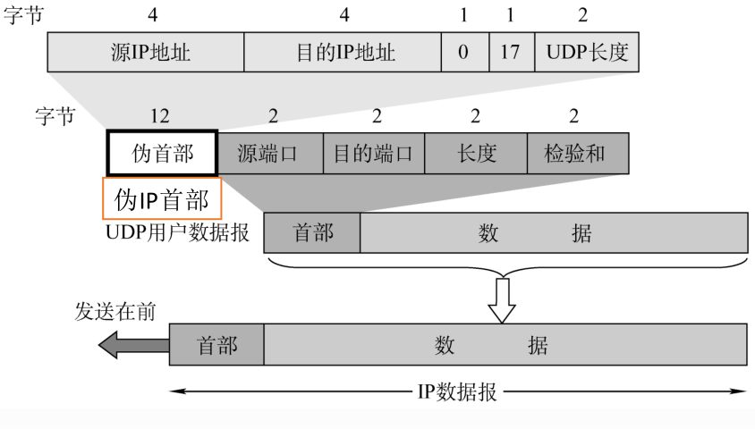

* content
{:toc}

传输层：只有主机才有的层次。为应用层提供通信服务，使用网络层的服务

传输层的功能：

```
1、传输层提供进程和进程之间的逻辑通信。

-----网络层提供主机之间的逻辑通信。

2、复用和分用

3、传输层对收到的报文进行差错检测。（数据部分）

-----网络层的首部校验和只校验了头部，没有校验数据部分

4、传输层的两个协议
```


tcp:
```
传送数据之前必须建立连接，数据传送结束后要释放连接。不提供广播或多播服务。由于TCP要提供可靠的面向连接的传输服务，因此不可避免增加了许多开销确认、流量控制、计时器及连接管理等。
可靠，面向连接，时延大，适用于大文件
```


upd：
```
传送数据之前不需要建立连接，收到UDP报文后也不需要给出任何确认。
不可靠，无连接，时延小，适用于小文件。
```


**传输层的寻址与端口**

复用：应用层所有的应用进程都可以通过传输层再传输到网络层。
分用：传输层从网络层收到数据后交付指明的应用进程。
逻辑端口/软件端口端口是传输层的SAP，标识主机中的应用进程

端口号只有本地意义，在因特网中不同计算机的相同端口是没有联系的。

端口号长度为16bit，能表示65536个不同的端口号。

端口号：

- 服务端使用的端口号
  - 熟知端口号【0~1023】：给TCP/IP最重要的一些程序，让所有的用户都知道
  - 登记端口号【1024~49151】：为没有熟知端口号的应用程序使用的。
- 客户端使用的端口号【49152~65535】：仅在客户进程运行时才动态选择的端口号

| 应用层序   | FTP  | TELNET | SMTP | DNS  | TFTP | HTTP | SNMP |
| ---------- | ---- | ------ | ---- | ---- | ---- | ---- | ---- |
| 熟知端口号 | 21   | 23     | 25   | 53   | 69   | 80   | 161  |

# 套接字

在网络中采用发送方和接收方的套接字组合来识别端点，套接字唯一标识了网络中的一个主机和它上面的一个进程。

每个TCP连接有两个端点，TCP连接的端点叫做套接字（socket）或插口。

套接字 Socket=（主机P地址：端口号)

# TCP

传输控制协议

TCP协议特点：

1、TCP是面向连接（虚连接）的传输层协议。
2、每一条TCP连接只能有两个端点，每一条TCP连接只能是点对点的。
3、TCP提供可靠交付的服务，无差错、不丢失、不重复、按序到达。
​	可靠有序，不丢不重
4、TCP 提供全双工通信

发送缓存：准备发送的数据&已发送但尚未收到确认的数据
接收缓存：按序到达但尚未被接受应用程序读取的数据&不按序到达的数据

5、TCP 面向字节流

TCP把应用程序交下来的数据看成仅仅是一连串的**无结构的字节流**


**TCP和UPD发送报文**

- tcp并不关心应用进程一次把多长的报文发送到TCP的缓存中，而是根据对方给出的窗口值和当前网络拥塞的成都决定一个报文段包含多少字节。如果应用进程传送到TCP缓存的数据块太长，TCP就可以把它划分短一些再传送。如果应用程序一次只发来一个字节，TCP也可以等待积累有足够的字节后再构成报文段发送出去。
- UDP发送的报文长度是应用进程给出的

发送方缓存暂时存放：

（1）发送应用程序传送给发送方TCP准备发送的数据

（2）TCP已经发送但未㧅确认的数据

接收方缓存暂时存放：

（1）按序到达的，但尚未被接收应用程序读取的数据

（2）未按序到达的数据

## TCP报文段首部格式


序号：在一个TCP连接中传送的字节流中的每一个字节都按顺序编号，本字段表示本报文段所发送数据的第一个字节的序号。

确认号：期望收到对方下一个报文段的第一个数据字节的序号。若确认号为N，则证明到序号N1为止的所有数据都已正确收到。

数据偏移（首部长度）：TCP报文段的数据起始处距离TCP报文段的起始处有多远，以4B位单位，即1个数值是4B。


控制位：

紧急位URG:URG=1时，标明此报文段中有紧急数据，是高优先级的数据，应尽快传送，不用在缓存里排队，配合紧急指针字段使用。

确认位ACK:ACK=1时确认号有效，在连接建立后所有传送的报文段都必须把ACK置为1。

推送位PSH:PSH=1时，接收方尽快交付接收应用进程，不再等到缓存填满再向上交付。

复位RST:RST=1时，表明TCP连接中出现严重差错，必须释放连接，然后再重新建立传输链接。

同步位SYN:SYN=1时，表明是一个连接请求/连接接受报文。

终止位FIN:FIN=1时，表明此报文段发送方数据已发完，要求释放连接。


窗口：指的是发送本报文段的一方的接收窗口，即现在允许对方发送的数据量。

检验和：检验首部+数据，检验时要加上12B伪首部，第四个字段为6紧急指针：URG=1时才有意义，指出本报文段中紧急数据的字节数。

选项：最大报文段长度MSS、窗口扩大时间戳、选择确认.

TCP连接传输三个阶段：

​	连接建立------数据传输-------连接释放


TCP连接的建立采用**客户服务器**方式，主动发起连接建立的应用进程叫做客户，而被动等待连接建立的应用进程叫服务器。

## 三次握手

- ROUND 1

  客户端发送连接请求报文段，无应用层数据。SYN=1，seq=x（随机）

- ROUND 2

  服务器端为该TCP连接分配缓存和变量，并向客户端返回确认报文段，允许连接，无应用层数据。

  SYN=1，ACK=1，seq=y（随机），ack=x+1

- ROUND 3

  客户端为该TCP连接分配缓存和变量，并向服务器端返回确认的确认，可以携带数据SYN=0，ACK=1，seq=x+1，ack=y+1

SYN洪泛攻击

SYN洪泛攻击发生在OSI第四层，这种方式利用TCP协议的特性，就是三次握手。攻击者发送TCP SYN，SYN是TCP三次握手中的第一个数据包，而当服务器返回ACK后，该攻击者就不对其进行再确认，那这个TCP连接就处于挂起状态，也就是所谓的半连接状态，服务器收不到再确认的话，还会重复发送ACK给攻击者。这样更加会浪费服务器的资源。攻击者就对服务器发送非常大量的这种TCP连接，由于每一个都没法完成三次握手，所以在服务器上，这些TCP连接会因为挂起状态而消耗CPU和内存，最后服务器可能死机，就无法为正常用户提供服务了。

## 四次挥手

- ROUND 1

  客户端发送连接释放报文段，停止发送数据，主动关闭TCP连接。FIN=1，seg=u 

- ROUND 2

  服务器端回送一个确认报文段，客户到服务器这个方向的连接就释放了一一半关闭状态。ACK=1，seq=v，ack=u+1

- ROUND 3

  服务器端发完数据，就发出连接释放报文段，主动关闭TCP连接。FIN=1，ACK=1，seg=w，ack=u+1

- ROUND 4

  客户端回送一个确认报文段，再等到时间等待计时器设置的2MSL（最长报文段寿命）后，连接彻底关闭。

## TCP的可靠传输


TCP的可靠传输原理：

- 停止等待协议
- 连续ARQ协议
- 滑动窗口协议

可靠：证接收方进程从缓存区读出的字节流与发送方发出的字节流

TCP实现可靠传输的机制：

- 1、校验

  确认重传不分家，TCP的发送方在规定的时间内没有收到确认就要重传已发送的报文段。超时重传

- 2、序号

  序号字段指的是一个报文段第一个字节的序号。

- 3、确认

  累计确认

- 4、重传

  确认重传不分家，TCP的发送方在规定的时间内没有收到确认就要重传已发送的报文段。超时重传


重传时间：

- TCP采用自适应算法，动态改变重传时间RTTs（加权平均往返时间）

- 冗余ACK（冗余确认）

每当比期望序号大的失序报文段到达时，发送一个冗余ACK，指明下一个期待字节的序号。

例如：发送方己发送1，2，3，4，5报文段
```
--  接收方收到1，返回给1的确认（确认号为2的第一个字节）
--  接收方收到3，仍返回给1的确认（确认号为2的第一个字节）
--  接收方收到4，仍返回给1的确认（确认号为2的第一个字节）
--  接收方收到5，仍返回给1的确认（确认号为2的第一个字节）
--  发送方收到3个对于报文段1的冗余ACK→认为2报文段丢失，重传2号报文段( **快速重传** )
```

如何保存TCP的连接信息？ 

## TCP 流量控制

流量控制（flow control）：让发送方慢点，要让接收方来得及接收。

### 利用滑动窗口实现流量控制

在通信过程中，接收方根据自己接收缓存的大小，动态地调整发送方的发送窗口大小，即接收窗口rwnd（接收方设置确认报文段的窗口字段来将rwnd通知给发送方），发送方的发送窗口取接收窗口rwnd和拥塞窗口cwnd的最小值

发送窗口大小可以动态变化。


可以连续发送几个报文段，采用累计确认的机制。

累计确认的优点：容易实现，即使确认丢失也不必重传

累计确认的缺点：不能向发送方反映出接收方已经正确收到的所有分组信息。


一个例子：利用可变窗口进行流量控制举例

A向B发送数据，连接建立时，B告诉A:“我的rwnd=400（字节）”，设每一个报文段100B，报文段序号初始值为1。


TCP为每一个连接设有一个持续计时器（persistemce timer），只要TCP连接的一方收到对方的零窗口通知，就启动持续计时器

若持续计时器设置的时间到期就发送一个零窗口探测报文段。接收方收到探测报文段时给出现在的窗口值。

若窗口仍然是0，那么发送方就重新设置持续计时器。

## TCP拥塞控制

流量控制和拥塞控制的区别


拥塞控制的四种算法：

- 慢开始和拥塞避免算法

- 快重传和快恢复算法

### 慢开始和拥塞避免

​	下面讨论的拥塞控制也叫做基于窗口的拥塞控制。为此，发送方维持一个叫做拥塞窗口`cwnd`（congestion window）的状态变量。

​	拥塞窗口的大小取决于网络的拥塞程度，并且动态地在变化。发送方让自己的发送窗口等于拥塞窗口。

​	**发送方控制拥塞窗口的原则**：只要网络没有出现拥塞，拥塞窗口就可以再增大些，以便把更多的分组发送出去，这样就可以提高网络的利用率。但只要网络出现拥塞或有可能出现拥塞，就必须把拥塞窗口减小一些，以减少注入到网络中的分组数，以便缓解网络出现的拥塞。

​	**发送方判断网络出现拥塞**：当网络发生拥塞时，路由器就要丢弃分组。因此只要发送方没有按时收到应当到达的确认报文（即出现了超时），就可以猜想网络可能岀现了拥塞。现在通信线路的传输质量一般都很好，因传输出差错而丢弃分组的概率是很小的（远小于1%）。因此，<u>判断网络拥塞的依据就是出现了超时</u>。

---

下面将讨论拥塞窗口`cwnd`的大小是怎样变化的。我们从“慢开始算法”讲起。

慢开始算法的思路是这样的：当主机开始发送数据时，由于并不清楚网络的负荷情况，所以如果立即把大量数据字节注入到网络，那么就有可能引起网络发生拥塞。经验证明，较好的方法是先探测一下，即由小到大逐渐增大发送窗口，也就是说，由小到大逐渐增大拥塞窗口数值


**拥塞避免算法**的思路：让拥塞窗口`cwnd`缓慢地增大，即每经过一个往返时间`RTT`就把发送方的拥塞窗口`cwnd`加1，而不是像慢开始阶段那样加倍增长。因此在拥塞避免阶段就有“加法増大”`AI`（Additive increase）的特点。这表明在拥塞避免阶段，拥塞窗口`cwnd`按线性规律缓慢增长，比慢开始算法的拥塞窗口增长速率缓慢得多。


SMSS  :  Sender Maximum Segment Size 发送方最大报文字段大小 （单位字节）

ssthresh ： 慢开始门限，ssthresh = max{FlightSize / 2, 2 * SMSS}

FlightSize  :  正在网络中传送的数据量


为了防止拥塞窗口`cwnd`增长过大引起网络拥塞，还需要设置一个慢开始门限 `ssthresh`状态变量。

慢开始门限 ssthresh的用法如下：
- 当 cwnd < ssthresh时，使用上述的慢开始算法。
- 当 cwnd > ssthresh时，停止使用慢开始算法而改用拥塞避免算法。
- 当 cwnd = ssthresh时，既可使用慢开始算法，也可使用拥塞避免算法

指数增长规律：1 2 4 8 16 ...


说明：

​        当TCP连接进行初始化时，把拥塞窗口`cwnd`置为1。为了便于理解，图中的窗口单位不使用字节而使用报文段的个数。在本例中，慢开始门限的初始值设置为16个报文段，即`ssthresh=16`。在执行慢开始算法时，发送方每收到一个对新报文段的确认`ACK`，就把拥塞窗口值加1，然后开始下一轮的传输。
​	    因此拥塞窗口`cwnd`随着传输轮次按指数规律增长。当拥塞窗口`cwnd`増长到慢开始门限值`ssthresh`时（此时拥塞窗口`cwnd=16`），就改为执行拥塞避免算法，<u>拥塞窗口按线性规律增长</u>。但请注意，“拥塞避免”并非完全能够避免了拥塞。“拥塞避免”是说把拥塞窗口控制为按线性规律增长，使网络比较不容易出现拥塞。

​	当拥塞窗口`cwnd=24`时，网络出现了超时，发送方判断为网络拥塞。于是调整门限值 `ssthresh=cwnd/2=12`，同时设置拥塞窗口`cwnd=1`，进入慢开始阶段。
​	按照慢开始算法，发送方每收到一个对新报文段的确认`ACK`，就把拥塞窗口值加1。
​	当拥塞窗口`cwnd= ssthresh=12`时，改为执行拥塞避免算法，拥塞窗口按线性规律增大。
​	当拥塞窗口`cwnd=16`时，出现了一个新的情况，就是发送方一连收到3个对同一个报文段的重复确认（图中记为3-ACK）。关于这个问题要解释如下。有时，个别报文段会在网络中丢失，但实际上网络并未发生拥塞。如果发送方迟迟收不到确认，就会产生超时，就会误认为网络发生了拥塞。这就导致发送方错误地启动慢开始，把拥塞窗口cwd又设置为1，因而降低了传输效率


### 快重传和快恢复算法

1900年提出。

提出这两种算法基于以下考虑：

​		如果发送方设置的超时计时器时限已到但是还没有收到确认，那么很可能是网络中出现了拥塞，致使报文段在网络中的某处被丢弃，在这种情况下，TCP马上就把拥塞窗口`cwnd`减小到1，并执行慢开始算法，同时把开始门限值`ssthresh`减半。

​		但是有的时候，个别报文段会在网络中丢失，但实际上网络并未发生拥塞。如果发送方迟迟收不到确认，就会产生超时，就会误认为网络发生了拥塞。这就导致发送方错误地启动慢开始，把拥塞窗口`cwnd`又设置为1，因而降低了传输效率。


采用快重传算法可以让发送方尽早知道发生了个别报文段的丢失。

快重传算法首先要求接收方不要等待自己发送数据时才进行捎带确认，而是要立即发送确认，即使收到了失序的报文段也要立即发出对已收到的报文段的重复确认。（原来是累计确认）

如快重传示意图所示，接收方收到了M1和M2后都分别及时发出了确认。现假定接收方没有收到M3但却收到了M4。本来接收方可以什么都不做。

但按照快重传算法，接收方必须立即发送对M2的重复确认，以便让发送方及早知道接收方没有收到报文段M3。

发送方接着发送M5和M6。接收方收到后也仍要再次分别发出对M2的重复确认。这样，发送方共收到了接收方的4个对M2的确认，其中后3个都是重复确认。

快重传算法规定，发送方只要一连收到3个重复确认，就知道接收方确实没有收到报文段M3，因而应当立即进行重传（即“**快重传**”），这样就不会出现超时，发送方也不就会误认为出现了网络拥塞。

使用快重传可以使整个网络的吞吐量提高约20%


<center>快重传示意图</center>
## 主动队列管理AQM

上两节中，TCP拥塞控制并没有和网络层采取的策略联系起来，其实他们之间有密切的联系。

**假拥塞**
例如，假定一个路由器对某些分组的处理时间特别长，那么这就可能使这些分组中的数据部分（即TCP报文段）经过很长时间才能到达终点，结果引起发送方对这些报文段的重传。根据前面所讲的，重传会使TCP连接的发送端认为在网络中发生了拥塞。于是在TCP的发送端就采取了拥塞控制措施，但实际上网络并没有发生拥塞。


**尾部丢弃策略**
网络层的策略对TCP拥塞控制影响最大的就是路由器的**分组丢弃策略**。在最简单的情况下，路由器的队列通常都是按照“先进先出”`FIFO`的规则处理到来的分组。当队列已满时，以后再到达的所有分组将都被丢弃。这就叫做尾部丢弃策略( tail-drop policy )


**全局同步**
路由器的尾部丢弃往往会导致一连串分组的丢失，这就使发送方出现超时重传，使TCP进入拥塞控制的慢开始状态，结果使TCP连接的发送方突然把数据的发送速率降低到很小的数值。

更为严重的是，在网络中通常有很多的TCP连接（它们有不同的源点和终点），这些连接中的报文段通常是复用在网络层的IP数据报中传送。在这种情况下，若发生了路由器中的尾部丢弃，就可能会同时影响到很多条TCP连接，结果使这许多TCP连接在同一时间突然都进入到慢开始状态。这在TCP的术语中称为全局同步（global syncronization）。

全局同步使得全网的通信量突然下降了很多，而在网络恢复正常后，其通信量又突然增大很多。


**主动队列管理**

为了避免发生网络中的全局同步现象,1998年提出主动队列管理AQM（Active Queue Management）

所谓“主动”就是不要等到路由器的队列长度已经达到最大值时才不得不丢弃后面到达的分组，应当在队列长度达到某个值得警惕的数值时（即当网络拥塞有了某些拥塞征兆时），就主动丢弃到达的分组。

这样就提醒了发送方放慢发送的速率，因而有可能使网络拥塞的程度减轻，甚至不出现网络拥塞。

AQM可以有不同实现方法，其中曾流行多年的就是随机早期检测RED（Random Early Detection）RED还有几个不同的名称，如 Random Early Drop或 Random Early Discard（随机早期丢弃）。

AQM实际上就是对路由器中的分组排队进行智能管理，而不是简单地把队列的尾部丢弃。


**随机早期检测RED**

实现RED时需要使路由器维持两个参数，即队列长度最小门限和最大门限。当每一个分组到达时，RED就按照规定的算法先计算当前的平均队列长度。
（1）若平均队列长度小于最小门限，则把新到达的分组放入队列进行排队。
（2）若平均队列长度超过最大门限，则把新到达的分组丢弃
（3）若平均队列长度在最小门限和最大门限之间，则按照某一丢弃概率p把新到达的分组丢弃（这就体现了丢弃分组的随机性）。

由此可见，RED不是等到已经发生网络拥塞后才把所有在队列尾部的分组全部丢弃而是在检测到网络拥塞的早期征兆时（即路由器的平均队列长度达到一定数值时），就以概率p丢弃个别的分组，让拥塞控制只在个别的TCP连接上进行，因而避免发生全局性的拥塞控制。

现在已经有几种不同的算法来代替旧的RED,但都还在实验阶段

# UDP

用户数据报协。

UDP只在数据报服务之上增加了很少功能，即复用分用和差错检测功能。

UDP的主要特点：

```
1、UDP是无连接的，减少开销和发送数据之前的时延。

2、UDP使用最大努力交付，即不保证可靠交付

3、UDP是面向报文的，适合一次性传输少量数据的网络应用
- 注：应用层给UDP多长的报文，UDP就照样发送，即一次发一个完整报文。

4、没有拥塞控制，适合很多实时应用
- 例如：IP电话，视频会议

5、UDP首部开销小，8B，TCP 20B。
```


## UDP首部格式

16位源端口号+16目的端口号+16位UDP长度


16位UPD长度：UPD用户数据报得到整个长度。首部+数据字段

16位UDP检验和：检测整个UDP数据报是否有错，错就丢弃（包括首部字段和数据字段）


分用时，找不到对应的目的端口号，就丢弃报文，并给发送方发送ICMP“端口不可达”差错报告报文。

## UDP 校验

伪首部只有在计算检验和时才出现，不向下传送也不向上递交。

0：默认是0

17：封装UDP报文的P数据报首部协议字段是17

UDP长度：UDP首部8B+数据部分长度（不包括伪首部）。



在发送端：
1、填上伪首部
2、全0填充检验和字段
3、全0填充数据部分（UDP数据报要看成许多4B的字串接起来）
4、伪首部+首部+数据部分采用二进制反码求和
5、把和求反码填入检验和字段6去掉伪首部，发送

在接收端：
1、填上伪首部
2、伪首部+首部+数据部分采用二进制反码求和
3、结果全为1则无差错，否则丢弃数据报/交给应用层附上出差错的警告。